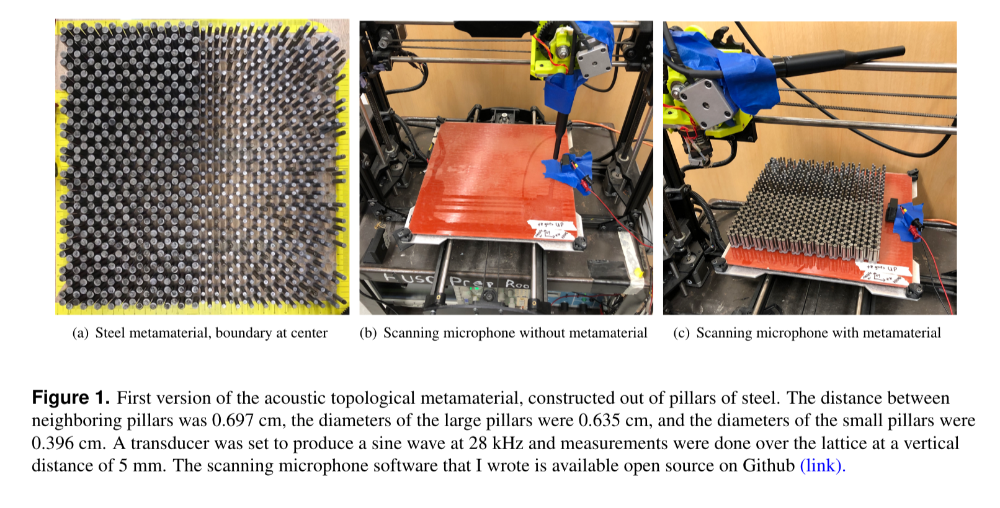
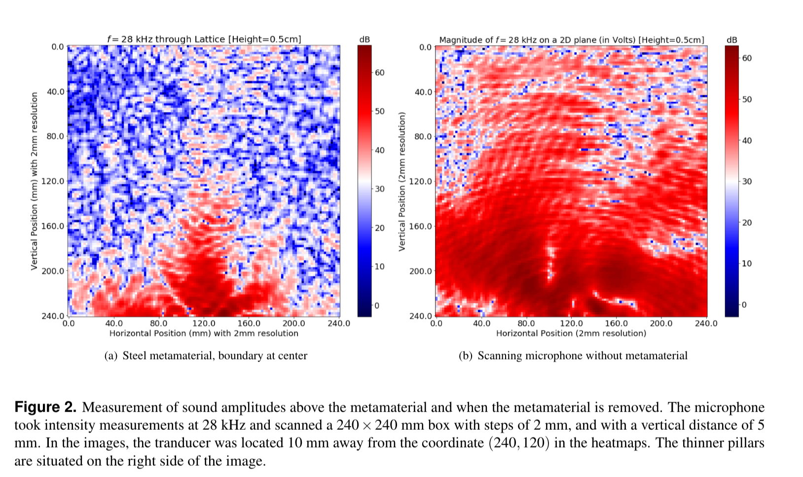

# Scanning Microphone

This is a repository for the scanning microphone setup used as a possible way
of imaging a phononic topological metamaterial. We are essentially using a
CNC controlled microphone to record audio samples from different locations in
our acoustic metamaterial (similar to the StM). This allows us to get 
high-resolution images of the acoustic dynamics of our system. 

## Example

In this example we scan 28 kHz for an acoustic metamaterial. We expect modes
down the boundary in the center (the region between thick and thin pillars)
to be topologically protected and everything else in the bulk to insulate.
Here is what the temporary setup looked like (all of the parts for this initial
test were just borrowed from Science Center 102).

Then, after scanning with a microphone that could pick up the 28 kHz sine wave
we broadcasted, we scanned a rectangular slice above the metamaterial to see
what is going on.

We see that the sound is conducting through the middle, and getting insulated
everywhere else! Nice!

As seen from the picture, our setup is divided into a few major sections, 
all of which have to be connected to your computer.

1. CNC Machine [(Setup Instructions)](printer/INSTRUCTIONS.md)
2. Microphone [(Setup Instructions)](microphone/INSTRUCTIONS.md)
3. Signal Generator [(Setup Instructions)](siggen/INSTRUCTIONS.md)

## Setup and Installation

### CNC Machine

The two main types of CNC machines that I experimented with was a 3D printer and
a CNC mill. I felt like the 3D printers were safer to use, since you can send
commands to turn off the heat and extruder. The setup instructions can be 
found [here.](printer/INSTRUCTIONS.md)

### Microphone

The two main types of microphones that were used were ones connected to the 
serial headphone jack, and oscilloscopes connected directly to the computer. 
The oscilloscopes were used because some of the frequencies used went over 22 
kHz, which normal sound cards don't handle. The setup instructions can be found 
[here.](microphone/INSTRUCTIONS.md)

### Signal Generator

There are also control scripts for a RIGOL Signal Generator. This is useful
if you want to vary the sound waves you send in or scanning different
frequencies as you go along. The setup instructions can be found
[here](siggen/INSTRUCTIONS.md).

## Postprocessing Measurements

There are a few different ways for performing the measurements, so I just
documented the few ways I tried measuring.
Some of the notebooks are available [here](processing/PROCESSING.md)

## Contact

For any inquiries about the setup or packages, contact 
`wfu (at) college.harvard.edu`. Will be happy to help if there are any questions
 about how to set up something similar.
