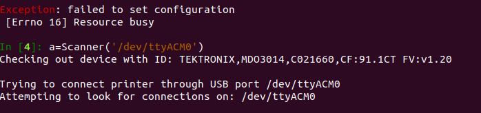

# Starting your First Scan

## Setup

Make sure that you at least set up the oscilloscope, connect it to the
microphone, and have verified that the 3D printer moves.

## Scanning

I find it easiest to start scanning using an interactive terminal, preferably
using `ipython`.
Go to the top level directory (the folder `scanning-microphone`), and start
the interactive terminal.

```bash
ipython
```

Then, make sure you get what serial the 3D printer is connected to (which you should have gotten during the setup stage) and put that as the argument to `serial` when initializing the scanner.

```python
>>> from scanner import Scanner
>>> scanner = Scanner(serial="/dev/ttyACM0")
```

Try to move the scanner to the appropriate starting location of the scan.

```python
>>> scanner.move_speed(x=-10, y=-10, z=-5, speed=5000)
```

The units for x, y, z are millimeters, and the speed is in units of mm/min.
Make sure that you orient yourself since there are no bounds checking - you'll just wear out the motors if you attempt to go out of bounds.
This is by default a blocking command, and you only regain use of the python program when it finishes.
If you want a nonblocking version (useful if you want to be collecting audio samples while the 3d printer is moving) then you can also use the function `move_speed_noblock` with the same arguments.

Once you have moved the microphone head to the correct location, you can do a scan.
Read the comments in each function implementation to see what's going on.
We can first scan a (100, 100) grid first as a test.
We will do 51 samples of the y dimension, so we increment by 2mm every time.
With the continuous scan method, the resolution on the x axis depends on
the speed of the nozzle and the samples per second (delay).
For this scope I recommend a delay of at least 0.1 or else sometimes the scope
won't have enough time to calculate the new FFT and you end up literally getting
the same spectrum throughout the entire scan.

```python
>>> scanner.scan_continuous_lattice((100, 100), 51, scan_speed=500, move_speed=6000, delay=0.1)
```

A progress bar should pop up with how much time the scan will take.
The data is saved to the `data` folder.

## Troubleshooting

### Errno 16 Resource Busy

If you get this error:



most likely what has happened is that you have another process that is already connected to the scanner.
Check if you have some other terminal open that is connected to the scanner.
Or, you can just kill all other python processes to make sure.

```bash
sudo pkill -9 python
```

Then, try to reconnect to the scanner, and it should work properly.


