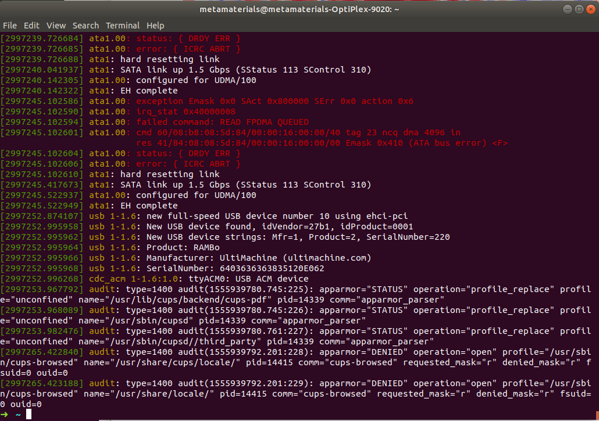
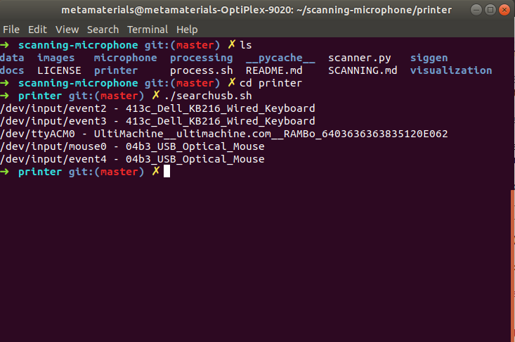
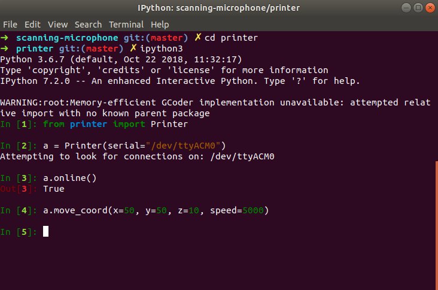

# Setting up the Science Center 3D Printer

This printer is the TAZ-LULZBOT 3D printer in Science Center 102.
If you want to use it, please message Rob! This 3D printer has been confirmed
to work with the Hoffman computer in LISE, it also comes on a wheeled cart
so it's easy to move back and forth if necessary. The 3D printer looks like
this.


Make sure that when you begin, the USB cable here is unplugged. It'll be 
easier to see what device the printer connects as if you start unplugged.

## Setup

### Initial Setup

Look at the [previous page](INSTRUCTIONS.md) for setup instructions. For my
setup, I used a computer with Ubuntu 18.04. It should work for 16.04 too,
and it should also work with any 3D printer.

### Connecting the Printer

Make sure you get a USB-A cable. Connect the USB end to the computer, and
make sure you are logged into the computer. Then, connect the USB-A end
into the 3D printer. Right after you do that, open a terminal and execute
the command:

```bash
dmesg
```

You should see some output that looks something like this:



You will see in the logging messages that the printer was connected as
device `/dev/ttyACM0`. Most likely, the device will be connected as either
`/dev/ttyACM0`, `/dev/ttyUSB0`, or `/dev/ttyUSB1` depending on which computer
you use. Make sure that you use this. 

Another method of getting the device location is by running the bash script
I have in my repository. However, this script won't work for all computers,
so if this script doesn't work the `dmesg` method will work fine.



### Moving the Printer

Now that we know which device the printer is located in, we can now see
if the computer communicates correctly with the printer. Run the following
commands to check with the printer. Make sure that you replace the path
given to `serial=` with the correct name that you got using `dmesg` or the
script.



Here are things you can do if our output doesn't match the one from the
image.

1. If ```a.online()``` returns False, try again after a few seconds to give the
printer time to connect. If it still returns False, something's wrong.
2. If `a.online()` returns True but the motor doesn't move, try reducing the
speed given. The speed is in units of `mm/min`.
3. If the motor still doesn't move or refuses the connect, try searching up
what baud rate the printer operates at. You can usually find this by Googling
`<my 3d printer mode> default baud rate`. Then, when connecting to the printer,
you can use `a = Printer(serial="<Your Serial Locaation>", baudrate=<your baud rate as integer>)`. 

## Troubleshooting

If you have questions, feel free to email `wfu [at] college.harvard.edu` and
I should respond pretty quickly.