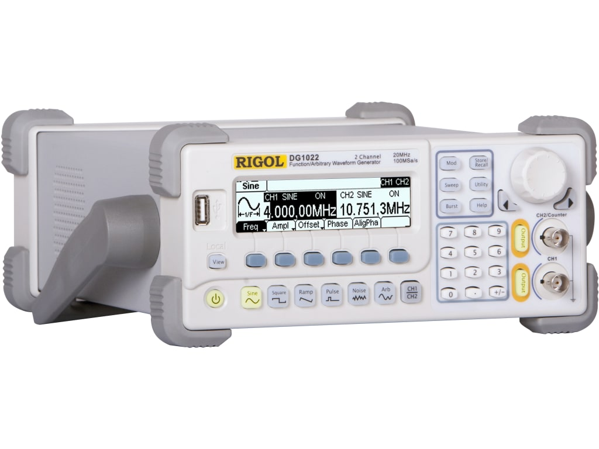

# Setting up the RIGOL DG1022

The RIGOL DG1022 was used to scan through different frequencies when measuring
the steel pillar metamaterial.
You should be able to get a lot of these signal generators from Science Center
102, or the Physics 191 lab, so ask Rob or Joe about getting access.
There's hundreds of them!



## Setup

If you haven't already, you'll have to install the `PyVISA` library to
communicate with the siggen and oscilloscope.
You can find the setup instructions for PyVisa [here.](https://pyvisa.readthedocs.io/en/stable/index.html)

## System Documentation

For some documentation of the commands and an extended programming manual
you can check out this [link.](http://int.rigol.com/File/UploadSpecific/20150909/DG1000%20Programming%20Guide.pdf)
This will probably be helpful if you want to extend some of the features
already implemented here.

## How to Use

The API is relatively simple.
Make sure that you connect the USB between the computer and the RIGOL signal generator.
Then, open an interactive terminal and import the signal generator.

```python
from siggen import SignalGenerator

signal = SignalGenerator()
signal.set_frequency(10000, amplitude=5, offset=5)
```

This will set channel 1 of the signal generator to emit a sine wave of 10000 Hz, with an amplitude of 5V peak to peak and an offset voltage of 5V.

## Troubleshooting

If pyvisa says "Found a device whose serial number cannot be read... try
making sure your user has permissions to read usb

    ```
    sudo groupadd usbusers
    sudo usermod -a -G usbusers <USERNAME>
    ```    

Also, you will have to add a USB rule.
    
    ```
    sudo vim /etc/udev/rules.d/99-com.rules
    ```

Add this line to it, and save.
    
    ```
    SUBSYSTEM=="usb", MODE="0666", GROUP="usbusers"
    ```

Then, restart the USB service, and everything should be working and you
should be able to see the RIGOL signal generator inside the list of devices
when searching for one using pyvisa.